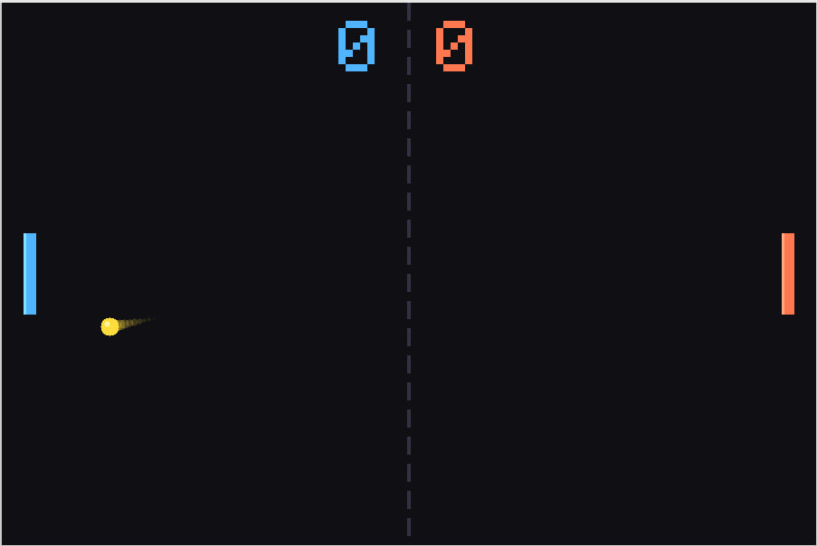
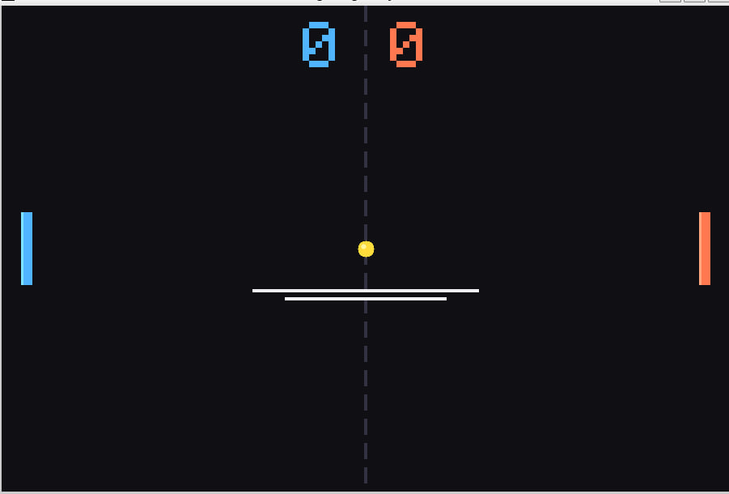

# Ping Pong 🏓

Jeu de **Ping Pong 2 joueurs** en **C++** avec SDL2.
Architecture orientée objet complète.

## Aperçu




## Contrôles

| Action | Joueur 1 (gauche) | Joueur 2 (droite) |
|--------|-------------------|-------------------|
| Monter | `W` | `↑` |
| Descendre | `S` | `↓` |
| Lancer la balle | `Espace` | `Espace` |
| Rejouer | `R` | `R` |
| Quitter | `Échap` | `Échap` |

## Fonctionnalités

- Jeu 2 joueurs en local sur le même clavier
- Rebonds réalistes — angle selon le point d'impact sur la raquette
- Accélération progressive de la balle à chaque rebond
- Traînée animée derrière la balle
- Affichage du score en temps réel
- Pause automatique de 2 secondes après chaque point
- Écran de victoire avec nom du gagnant
- Vitesse plafonnée pour garder le jeu jouable

## Architecture orientée objet (POO)

### Diagramme des classes

```
Ball
├── position    : float x, y
├── vitesse     : float vx, vy
├── rayon       : int radius
├── trail       : vector<TrailPoint>   ← traînée visuelle
├── launch()    → angle aléatoire au départ
├── update()    → déplacement + rebonds haut/bas
├── collide()   → détection AABB avec un Paddle
├── bounceOffPaddle() → calcul angle de rebond
└── draw()      → balle + traînée + reflet

Paddle
├── position    : float x, y
├── dimensions  : int w, h
├── couleur     : Color
├── score       : int
├── moveUp()    → déplacement avec limite écran
├── moveDown()  → déplacement avec limite écran
└── draw()      → corps + reflet lumineux

ScoreBoard
├── p1, p2      : int
├── reset()
└── draw()      → rendu via TTF_Font

Game
├── p1, p2      : Paddle
├── ball        : Ball
├── score       : ScoreBoard
├── state       : GameState (enum)
├── init()      → SDL + TTF + fenêtre + polices
├── run()       → boucle principale 60 FPS
├── handleEvent() → clavier
├── update()    → logique + collisions + score
├── render()    → fond + filet + objets + UI
└── cleanup()   → libération mémoire
```

### États du jeu (enum GameState)

```
WAITING   → Balle immobile, attente appui ESPACE
    ↓ ESPACE
PLAYING   → Jeu en cours
    ↓ point marqué
SCORED    → Pause 2s puis retour WAITING
    ↓ score = WIN_SCORE
GAMEOVER  → Écran victoire, attente R pour rejouer
    ↓ R
WAITING
```

### Physique de la balle

```cpp
/* Angle de rebond selon le point d'impact sur la raquette */
float rel   = (y - center) / (hauteur / 2.0f); /* [-1.0 .. 1.0] */
float angle = rel * 60°;
vx = direction * speed * cos(angle);
vy = speed * sin(angle);
```

## Compilation

```bash
# Linux / macOS
g++ -std=c++17 -o pong pong.cpp \
    $(sdl2-config --cflags --libs) -lSDL2_ttf

# Windows (MinGW)
g++ -std=c++17 -o pong pong.cpp \
    -lSDL2 -lSDL2main -lSDL2_ttf
```

## Dépendances

- SDL2
- SDL2_ttf (pour l'affichage du score)

```bash
# Ubuntu / Debian
sudo apt install libsdl2-dev libsdl2-ttf-dev

# macOS (Homebrew)
brew install sdl2 sdl2_ttf
```

## Paramètres modifiables

Dans `pong.cpp` en haut du fichier :

```cpp
static const int   WIN_SCORE    = 7;     /* points pour gagner     */
static const int   PADDLE_H     = 90;    /* hauteur raquette px    */
static const int   PADDLE_SPEED = 7;     /* vitesse raquette px/fr */
static const float BALL_SPEED_0 = 5.5f; /* vitesse initiale balle */
static const float BALL_ACCEL   = 0.35f;/* accélération par rebond*/
static const float BALL_MAX_SPD = 14.0f;/* vitesse maximale       */
```

## Compétences acquises

- Classes C++ avec encapsulation (attributs privés, méthodes publiques)
- Enum class pour la machine à états du jeu
- Gestion de la boucle de jeu à 60 FPS (game loop)
- Détection de collisions AABB (Axis-Aligned Bounding Box)
- Physique 2D — calcul d'angles et vecteurs de vitesse
- Rendu graphique avec SDL2 (cercles, rectangles)
- Affichage de texte avec SDL2_ttf
- Gestion des événements clavier
- Composition de classes (Game contient Ball, Paddle, ScoreBoard)


## Auteur

Tarash Pavlo

PavloT01
